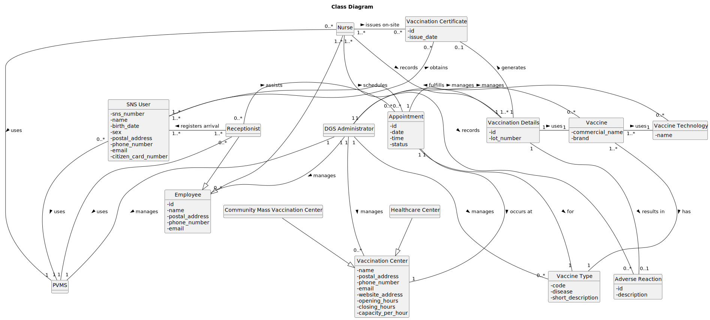

# OO Analysis

The construction process of the domain model is based on the client specifications, especially the nouns (for _concepts_) and verbs (for _relations_) used.

## Rationale to identify domain conceptual classes
To identify domain conceptual classes, start by making a list of candidate conceptual classes inspired by the list of categories suggested in the book "Applying UML and Patterns: An Introduction to Object-Oriented Analysis and Design and Iterative Development".

### _Conceptual Class Category List_

**Business Transactions**

- Appointment
- Vaccine Administration

---

**Transaction Line Items**

- Vaccination Details

---

**Product/Service related to a Transaction or Transaction Line Item**

- Vaccine

---

**Transaction Records**

- Vaccination Certificate

---

**Roles of People or Organizations**

- Nurse
- Receptionist
- DGS Administrator

---

**Places**

- Healthcare Center
- Community Mass Vaccination Center
- Vaccination Center

---

**Noteworthy Events**

- Adverse Reaction

---

**Physical Objects**

- Citizen Card
- SNS User Number

---

**Descriptions of Things**

- Vaccine Type
- Vaccine Technology

---

**Catalogs**

---

**Containers**

---

**Elements of Containers**

- Scheduled Users

---

**(Other) Organizations**

- DGS (Direção-Geral da Saúde)

---

**Other (External/Collaborating) Systems**

- PVMS (Pandemic Vaccination Management System)

---

**Records of finance, work, contracts, legal matters**

- Appointment Log

---

**Financial Instruments**

- Not applicable

---

**Documents mentioned/used to perform some work**

- Vaccination Certificate

---

## Rationale to identify associations between conceptual classes

An association is a relationship between instances of objects that indicates a relevant connection and that is worth remembering, or it is derivable from the List of Common Associations:

| Concept (A)                     | Association                  | Concept (B)                        |
|---------------------------------|:---------------------------:|------------------------------------|
| SNS User                         | schedules                   | Appointment                         |
| Appointment                      | confirmed by                | Receptionist                        |
| Appointment                      | occurs at                   | Vaccination Center                  |
| Nurse                            | administers                 | Vaccine                             |
| Nurse                            | records                     | Vaccination Details                 |
| Vaccination Details               | associated with             | Vaccine                             |
| Vaccination Details               | logged in                   | PVMS                                |
| Vaccination Certificate           | issued to                   | SNS User                            |
| Receptionist                      | registers                   | SNS User                            |
| Healthcare Center                 | contains                    | Waiting Room                        |
| Healthcare Center                 | contains                    | Recovery Room                       |
| DGS Administrator                 | manages                     | Staff Catalog                        |
| DGS Administrator                 | manages                     | Vaccine Catalog                       |
| Vaccine                           | categorized by              | Vaccine Type                          |
| Vaccine                           | developed using             | Vaccine Technology                    |
| Vaccination Center                | has staff                   | Nurse                                |
| Vaccination Center                | has staff                   | Receptionist                          |
| Community Mass Vaccination Center | is a type of                | Vaccination Center                    |
| Adverse Reaction                  | recorded by                 | Nurse                                |

## Domain Model

